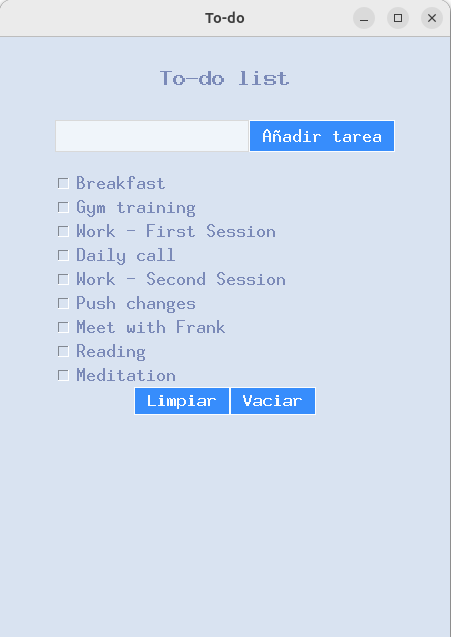
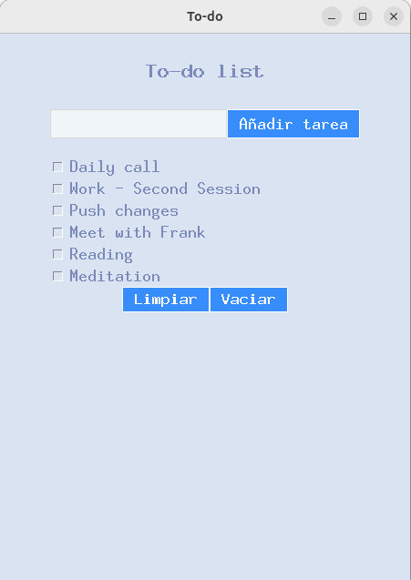

Sure! Here's the English version of the `README.md` for your Tkinter To-Do List app:

---

# 📝 To-Do List Desktop App

A simple and functional desktop app to manage your daily tasks, built with **Python** and **Tkinter**. Add, mark, unmark, clear completed tasks, or wipe the entire list with ease.

## 🚀 Features

- **Add tasks**: Type in a task and click "Add" to include it in the list.
- **Mark/unmark tasks**: Click on a task to toggle its completion status.
- **Clear completed**: Remove all tasks that are marked as completed with one click.
- **Empty list**: Delete all tasks, completed or not, using the "Empty" button.
- **User-friendly interface**: Designed with Tkinter for a clean and intuitive experience.

## 📸 Screenshots

<p align="center">
  
  
  
</p>


## 🛠️ Requirements

- Python 3.x
- Tkinter (included by default in most Python installations)
- ttkbootstrap (install with 'pip install ttkbootstrap')

## 📥 Installation

1. Clone the repository:
   ```bash
   git clone https://github.com/damixtech/To-Do-List-Desktop.git
   ```

2. Navigate to the project folder:
   ```bash
   cd to-do-list-desktop
   ```

3. Run the application:
   ```bash
   python app.py
   ```

## 🤝 Contributing

Contributions are welcome! If you'd like to enhance this app:

- Fork the repository
- Create a new branch (`git checkout -b feature/new-feature`)
- Commit your changes (`git commit -am 'Add new feature'`)
- Push to the branch (`git push origin feature/new-feature`)
- Open a Pull Request describing your changes

## 📝 License

This project is licensed under the MIT License.

---


# 📝 To-Do List Desktop App

Una aplicación sencilla y funcional para gestionar tus tareas diarias, desarrollada con **Python** y la biblioteca **Tkinter**. Permite añadir, marcar como completadas, eliminar tareas específicas o vaciar toda la lista con facilidad. 

## 🚀 Características

- **Añadir tareas**: Escribe una tarea en el campo de entrada y haz clic en "Añadir" para agregarla a la lista.
- **Marcar/desmarcar tareas**: Haz clic en una tarea para marcarla como completada; haz clic nuevamente para desmarcarla.
- **Limpiar tareas completadas**: Elimina todas las tareas marcadas como completadas con un solo clic en "Limpiar".
- **Vaciar lista**: Elimina todas las tareas de la lista, independientemente de su estado, al hacer clic en "Vaciar".
- **Interfaz gráfica intuitiva**: Diseñada con Tkinter para una experiencia de usuario sencilla y directa.

## 📸 Capturas de pantalla

<p align="center">
  
  
  
</p>


## 🛠️ Requisitos

- Python 3.x
- Tkinter (generalmente incluido en las instalaciones estándar de Python) 
- ttkbootstrap (puedes instalarlo con 'pip install ttkbootstrap')

## 📥 Instalación

1. Clona este repositorio:
   ```bash
   git clone https://github.com/damixtech/To-Do-List-Desktop.git
   ```


2. Navega al directorio del proyecto:
   ```bash
   cd to-do-list-desktop
   ```


3. Ejecuta la aplicación:
   ```bash
   python app.py
   ```

## 🤝 Contribuciones

Las contribuciones son bienvenidas. Si deseas mejorar esta aplicación, por favor:

- Haz un fork del repositorio.
- Crea una nueva rama (`git checkout -b feature/nueva-funcionalidad`).
- Realiza tus cambios y haz commit (`git commit -am 'Añadir nueva funcionalidad'`).
- Haz push a la rama (`git push origin feature/nueva-funcionalidad`).
- Abre un Pull Request describiendo tus cambios.

## 📝 Licencia

Este proyecto está licenciado bajo la Licencia MIT.
